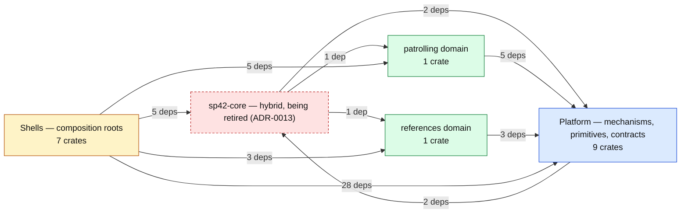
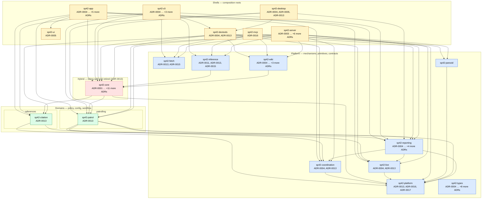

# SP42 architecture map

<!-- GENERATED FILE — do not edit by hand. -->
<!-- Regenerate with: scripts/generate-architecture-map.sh -->
<!-- Verify freshness with: scripts/generate-architecture-map.sh --check -->

The workspace crate graph, layered per
[ADR-0013](adr/0013-layered-platform-domain-architecture.md), annotated with
the ADRs that shaped each crate. Crates and dependency edges come from
`cargo metadata`; layers come from the map in `scripts/check-layering.sh`;
an ADR or PRD is linked to a crate when the document names that crate.

The dependency invariant (`platform ◄─ domains ◄─ shells`) is *enforced*
by `scripts/check-layering.sh` — this page is the picture, not the police.

## Layer overview

One node per layer (domains shown individually); edge labels count the
underlying crate-to-crate dependencies, drawn in full in the next diagram.

## Crate-level map

Reading notes:

- Edges into `sp42-types` are omitted — every crate depends on it.
- `sp42-core` is the documented hybrid exemption from ADR-0013: a re-export
  facade being split into platform/domain crates and retired.
- Node annotations list the ADRs that name the crate.

## Decision coverage by crate

| Crate | Layer | ADRs that name it | PRDs that name it | Notes |
|---|---|---|---|---|
| `sp42-app` | shell | [ADR-0004](adr/0004-crate-boundary-collaboration-model.md), [ADR-0005](adr/0005-design-system-shared-component-layer.md), [ADR-0008](../domains/references/adr/0008-citation-verification-contract.md), [ADR-0010](adr/0010-operator-confirmed-content-proposals.md), [ADR-0012](adr/0012-frontend-e2e-testing-approach.md), [ADR-0013](adr/0013-layered-platform-domain-architecture.md) | [PRD-0002](../domains/patrolling/prd/0002-patrol-review-workflow.md), [PRD-0006](../domains/patrolling/prd/0006-multi-operator-coordination.md), [PRD-0010](../domains/references/prd/0010-citation-verification-mcp-surface.md) |  |
| `sp42-citation` | domain | [ADR-0013](adr/0013-layered-platform-domain-architecture.md) | — |  |
| `sp42-cli` | shell | [ADR-0004](adr/0004-crate-boundary-collaboration-model.md), [ADR-0005](adr/0005-design-system-shared-component-layer.md), [ADR-0013](adr/0013-layered-platform-domain-architecture.md), [ADR-0015](../domains/references/adr/0015-rules-compliant-read-only-fetch-edge.md) | [PRD-0001](../domains/references/prd/0001-citation-verification.md) |  |
| `sp42-coordination` | platform | [ADR-0004](adr/0004-crate-boundary-collaboration-model.md), [ADR-0013](adr/0013-layered-platform-domain-architecture.md) | [PRD-0006](../domains/patrolling/prd/0006-multi-operator-coordination.md) |  |
| `sp42-core` | hybrid | [ADR-0001](adr/0001-foundational-decisions.md), [ADR-0003](adr/0003-node-anchored-wikitext-editing.md), [ADR-0004](adr/0004-crate-boundary-collaboration-model.md), [ADR-0005](adr/0005-design-system-shared-component-layer.md), [ADR-0006](adr/0006-using-llms.md), [ADR-0007](../domains/references/adr/0007-citation-verification-semantics.md), [ADR-0008](../domains/references/adr/0008-citation-verification-contract.md), [ADR-0009](../domains/references/adr/0009-citation-source-snapshot-storage.md), [ADR-0010](adr/0010-operator-confirmed-content-proposals.md), [ADR-0011](../domains/references/adr/0011-article-citation-verification.md), [ADR-0013](adr/0013-layered-platform-domain-architecture.md), [ADR-0015](../domains/references/adr/0015-rules-compliant-read-only-fetch-edge.md) | [PRD-0001](../domains/references/prd/0001-citation-verification.md), [PRD-0002](../domains/patrolling/prd/0002-patrol-review-workflow.md), [PRD-0004](../domains/patrolling/prd/0004-reviewer-actions-on-wikimedia.md), [PRD-0005](../domains/patrolling/prd/0005-operator-identity-and-session.md), [PRD-0007](../domains/references/prd/0007-llm-output-benchmarking.md), [PRD-0015](../domains/assessment/prd/0015-article-stability-signal.md) | Hybrid exemption — re-export facade being split into platform/domain crates and retired ([ADR-0013](adr/0013-layered-platform-domain-architecture.md)) |
| `sp42-desktop` | shell | [ADR-0004](adr/0004-crate-boundary-collaboration-model.md), [ADR-0005](adr/0005-design-system-shared-component-layer.md), [ADR-0013](adr/0013-layered-platform-domain-architecture.md) | — |  |
| `sp42-devtools` | shell | [ADR-0004](adr/0004-crate-boundary-collaboration-model.md), [ADR-0013](adr/0013-layered-platform-domain-architecture.md) | [PRD-0006](../domains/patrolling/prd/0006-multi-operator-coordination.md) |  |
| `sp42-fetch` | platform | [ADR-0013](adr/0013-layered-platform-domain-architecture.md), [ADR-0015](../domains/references/adr/0015-rules-compliant-read-only-fetch-edge.md) | — |  |
| `sp42-inference` | platform | [ADR-0011](../domains/references/adr/0011-article-citation-verification.md), [ADR-0013](adr/0013-layered-platform-domain-architecture.md), [ADR-0015](../domains/references/adr/0015-rules-compliant-read-only-fetch-edge.md) | — | Still depends on `sp42-core`; edge disappears when the facade is retired ([ADR-0013](adr/0013-layered-platform-domain-architecture.md)) |
| `sp42-live` | platform | [ADR-0004](adr/0004-crate-boundary-collaboration-model.md), [ADR-0013](adr/0013-layered-platform-domain-architecture.md) | [PRD-0002](../domains/patrolling/prd/0002-patrol-review-workflow.md), [PRD-0004](../domains/patrolling/prd/0004-reviewer-actions-on-wikimedia.md) |  |
| `sp42-mcp` | shell | [ADR-0016](adr/0016-wikidata-entity-content-model.md) | — |  |
| `sp42-parsoid` | platform | — | — |  |
| `sp42-patrol` | domain | [ADR-0013](adr/0013-layered-platform-domain-architecture.md) | — |  |
| `sp42-platform` | platform | [ADR-0013](adr/0013-layered-platform-domain-architecture.md), [ADR-0016](adr/0016-wikidata-entity-content-model.md), [ADR-0017](adr/0017-wikidata-statement-proposal-write-contract.md) | — |  |
| `sp42-reporting` | platform | [ADR-0004](adr/0004-crate-boundary-collaboration-model.md), [ADR-0008](../domains/references/adr/0008-citation-verification-contract.md), [ADR-0009](../domains/references/adr/0009-citation-source-snapshot-storage.md), [ADR-0013](adr/0013-layered-platform-domain-architecture.md), [ADR-0016](adr/0016-wikidata-entity-content-model.md) | [PRD-0002](../domains/patrolling/prd/0002-patrol-review-workflow.md) |  |
| `sp42-server` | shell | [ADR-0003](adr/0003-node-anchored-wikitext-editing.md), [ADR-0004](adr/0004-crate-boundary-collaboration-model.md), [ADR-0005](adr/0005-design-system-shared-component-layer.md), [ADR-0008](../domains/references/adr/0008-citation-verification-contract.md), [ADR-0009](../domains/references/adr/0009-citation-source-snapshot-storage.md), [ADR-0013](adr/0013-layered-platform-domain-architecture.md), [ADR-0015](../domains/references/adr/0015-rules-compliant-read-only-fetch-edge.md) | [PRD-0002](../domains/patrolling/prd/0002-patrol-review-workflow.md), [PRD-0003](../domains/patrolling/prd/0003-edit-scoring-and-queue-ranking.md), [PRD-0004](../domains/patrolling/prd/0004-reviewer-actions-on-wikimedia.md), [PRD-0005](../domains/patrolling/prd/0005-operator-identity-and-session.md), [PRD-0006](../domains/patrolling/prd/0006-multi-operator-coordination.md) |  |
| `sp42-types` | platform | [ADR-0004](adr/0004-crate-boundary-collaboration-model.md), [ADR-0005](adr/0005-design-system-shared-component-layer.md), [ADR-0008](../domains/references/adr/0008-citation-verification-contract.md), [ADR-0009](../domains/references/adr/0009-citation-source-snapshot-storage.md), [ADR-0011](../domains/references/adr/0011-article-citation-verification.md), [ADR-0013](adr/0013-layered-platform-domain-architecture.md), [ADR-0015](../domains/references/adr/0015-rules-compliant-read-only-fetch-edge.md), [ADR-0016](adr/0016-wikidata-entity-content-model.md), [ADR-0017](adr/0017-wikidata-statement-proposal-write-contract.md) | — |  |
| `sp42-ui` | shell | [ADR-0005](adr/0005-design-system-shared-component-layer.md) | — |  |
| `sp42-wiki` | platform | [ADR-0004](adr/0004-crate-boundary-collaboration-model.md), [ADR-0005](adr/0005-design-system-shared-component-layer.md), [ADR-0013](adr/0013-layered-platform-domain-architecture.md), [ADR-0014](adr/0014-wikimedia-oauth-and-any-project.md) | [PRD-0005](../domains/patrolling/prd/0005-operator-identity-and-session.md) | Still depends on `sp42-core`; edge disappears when the facade is retired ([ADR-0013](adr/0013-layered-platform-domain-architecture.md)) |

## ADR index

| ADR | Title | Status | Home | Crates it names |
|---|---|---|---|---|
| [ADR-0001](adr/0001-foundational-decisions.md) | Foundational architectural decisions | Accepted | platform | `sp42-core` |
| [ADR-0002](adr/0002-local-dev-auth-bridge.md) | Local dev-auth bridge contract | Accepted | platform | — |
| [ADR-0003](adr/0003-node-anchored-wikitext-editing.md) | Node-anchored wikitext editing for content actions | Accepted | platform | `sp42-core`, `sp42-server` |
| [ADR-0004](adr/0004-crate-boundary-collaboration-model.md) | Crate boundaries for collaborative feature ownership | Accepted | platform | `sp42-app`, `sp42-cli`, `sp42-coordination`, `sp42-core`, `sp42-desktop`, `sp42-devtools`, `sp42-live`, `sp42-reporting`, `sp42-server`, `sp42-types`, `sp42-wiki` |
| [ADR-0005](adr/0005-design-system-shared-component-layer.md) | Design system and shared component layer (`sp42-ui`) | Proposed | platform | `sp42-app`, `sp42-cli`, `sp42-core`, `sp42-desktop`, `sp42-server`, `sp42-types`, `sp42-ui`, `sp42-wiki` |
| [ADR-0006](adr/0006-using-llms.md) | Using LLMs in SP42 — model panel, measured agreement, and the inference endpoint | Accepted | platform | `sp42-core` |
| [ADR-0007](../domains/references/adr/0007-citation-verification-semantics.md) | Citation verification verdict and anti-fabrication semantics | Accepted | references | `sp42-core` |
| [ADR-0008](../domains/references/adr/0008-citation-verification-contract.md) | Citation verification request/response contract | Accepted | references | `sp42-app`, `sp42-core`, `sp42-reporting`, `sp42-server`, `sp42-types` |
| [ADR-0009](../domains/references/adr/0009-citation-source-snapshot-storage.md) | Source-snapshot storage for verification reproducibility | Accepted | references | `sp42-core`, `sp42-reporting`, `sp42-server`, `sp42-types` |
| [ADR-0010](adr/0010-operator-confirmed-content-proposals.md) | Operator-confirmed content proposals (propose/confirm) | Accepted | platform | `sp42-app`, `sp42-core` |
| [ADR-0011](../domains/references/adr/0011-article-citation-verification.md) | Article-level citation verification (the review path) | Accepted | references | `sp42-core`, `sp42-inference`, `sp42-types` |
| [ADR-0012](adr/0012-frontend-e2e-testing-approach.md) | Frontend end-to-end testing approach | Proposed | platform | `sp42-app` |
| [ADR-0013](adr/0013-layered-platform-domain-architecture.md) | Layered platform/domain architecture with mechanical enforcement | Accepted | platform | `sp42-app`, `sp42-citation`, `sp42-cli`, `sp42-coordination`, `sp42-core`, `sp42-desktop`, `sp42-devtools`, `sp42-fetch`, `sp42-inference`, `sp42-live`, `sp42-patrol`, `sp42-platform`, `sp42-reporting`, `sp42-server`, `sp42-types`, `sp42-wiki` |
| [ADR-0014](adr/0014-wikimedia-oauth-and-any-project.md) | Required Wikimedia OAuth login + any-Wikimedia-project resolution | Accepted | platform | `sp42-wiki` |
| [ADR-0015](../domains/references/adr/0015-rules-compliant-read-only-fetch-edge.md) | Rules-compliant read-only fetch edge | Accepted | references | `sp42-cli`, `sp42-core`, `sp42-fetch`, `sp42-inference`, `sp42-server`, `sp42-types` |
| [ADR-0016](adr/0016-wikidata-entity-content-model.md) | Wikidata entity content-model — revision read, `EntityDiff`, and content-model routing | Proposed | platform | `sp42-mcp`, `sp42-platform`, `sp42-reporting`, `sp42-types` |
| [ADR-0017](adr/0017-wikidata-statement-proposal-write-contract.md) | Wikidata statement-proposal write contract | Proposed | platform | `sp42-platform`, `sp42-types` |

## PRD index

| PRD | Title | State | Domain | ADRs it references |
|---|---|---|---|---|
| [PRD-0001](../domains/references/prd/0001-citation-verification.md) | Citation verification — initial implementation | Implemented | references | ADR-0006, ADR-0007, ADR-0008, ADR-0009 |
| [PRD-0002](../domains/patrolling/prd/0002-patrol-review-workflow.md) | Patrol review workflow | Implemented | patrolling | ADR-0001, ADR-0002, ADR-0003 |
| [PRD-0003](../domains/patrolling/prd/0003-edit-scoring-and-queue-ranking.md) | Edit scoring and queue ranking | Implemented | patrolling | ADR-0001 |
| [PRD-0004](../domains/patrolling/prd/0004-reviewer-actions-on-wikimedia.md) | Reviewer actions on Wikimedia | Implemented | patrolling | ADR-0003 |
| [PRD-0005](../domains/patrolling/prd/0005-operator-identity-and-session.md) | Operator identity and session | Implemented | patrolling | ADR-0002 |
| [PRD-0006](../domains/patrolling/prd/0006-multi-operator-coordination.md) | Multi-operator coordination | Implemented | patrolling | ADR-0001 |
| [PRD-0007](../domains/references/prd/0007-llm-output-benchmarking.md) | LLM output-quality benchmarking | Accepted | references | ADR-0007, ADR-0010 |
| [PRD-0008](../domains/references/prd/0008-bare-url-repair.md) | Bare-URL repair | Implemented | references | ADR-0002, ADR-0003, ADR-0010 |
| [PRD-0009](../domains/references/prd/0009-book-citation-grounding-and-open-library-enrichment.md) | Book-citation grounding and Open Library enrichment | Draft (grounding pipeline shipped — source fetch, body | references | ADR-0004, ADR-0006, ADR-0007, ADR-0009, ADR-0010, ADR-0011, ADR-0017 |
| [PRD-0010](../domains/references/prd/0010-citation-verification-mcp-surface.md) | Citation-verification agent surface (MCP) | Implemented | references | ADR-0007, ADR-0008 |
| [PRD-0011](../domains/wikidata/prd/0011-wikidata-first-class-target.md) | Wikidata as a first-class SP42 target | Draft | wikidata | ADR-0003, ADR-0007, ADR-0009, ADR-0010, ADR-0014, ADR-0016, ADR-0017 |
| [PRD-0015](../domains/assessment/prd/0015-article-stability-signal.md) | Article stability signal | Discussion | assessment | ADR-0006, ADR-0007, ADR-0009, ADR-0011, ADR-0014 |
